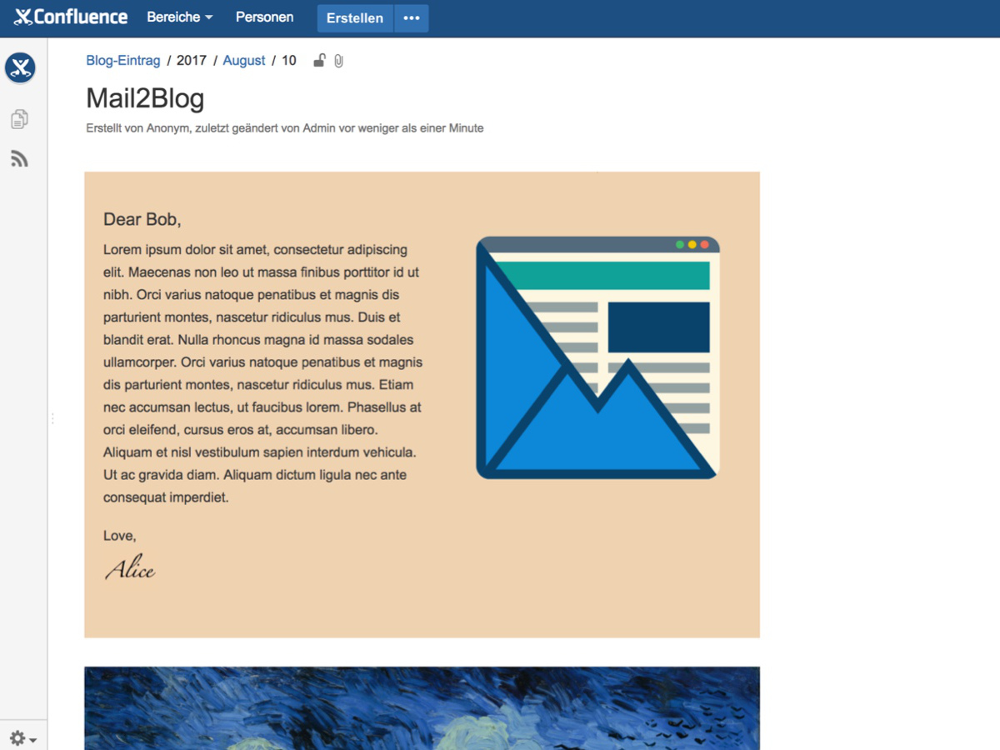

<h1 align="center">Email to Confluence</h1>

    
     
    
    

Send email to Confluence. This add-on converts emails to Confluence pages or blog posts. Store and reference your weekly/daily/monthly newsletters in Confluence.

    

#### Features

- Supports POP3(s) and IMAP(s)
- Supports plain text, HTML and attachments
- Can handle MIME-mails and allows setting a preferred format (HTML or plain text)
- Supports complex HTML newsletters
- Customizable HTML filters
- Supports filtering sender addresses
- Supports blocking attachments with dangerous extensions
- Can post into different spaces

## First Steps

This add-on is available on the [Atlassian Marketplace](https://marketplace.atlassian.com/plugins/de.dm.mail2blog.mail2blog/server/overview).

Manual Installation:

1. Download the latest release from the release tab.
2. [Install the plug-in by uploading it to your Confluence instance](https://confluence.atlassian.com/upm/installing-add-ons-273875715.html#Installingadd-ons-Installingbyfileupload).

After installation:

1. Go to `admin/plugins/mail2blog/editmailconfiguration.action`
2. Fill in the fields for the mail configuration
3. Choose a default [space](https://confluence.atlassian.com/doc/spaces-139459.html) into which to post
4. Save the configuration

From now on **every 5 minutes** Confluence will pull messages from your **INBOX**
and post them as blog posts into the default space.

The configuration is explained on the configuration page.
Formatting options are explained in detail [here](doc/formatting.md).

## Further Information
- [Formatting](doc/formatting.md)
- [Technical Documentation](doc/technical_documentation.md)
- [Security Guide](doc/security_guide.md)
- [FAQ](doc/faq.md)
- [Konzeption und Entwicklung des Confluence-Add-ons Mail2Blog (German)](doc/konzeption_und_entwicklung_des_confluence_add_ons_mail2blog.pdf)
- [Code Of Conduct](CODE_OF_CONDUCT.md)
- [License](LICENSE.txt)

## Origins

The project started off as a fork of the [Confluence-Mail-to-News-Plugin](https://github.com/stimmt/Confluence-Mail-to-News-Plugin) by Liip AG.
But the source code has been completely refactored and we added plenty of new features, bugfixes and tests.
The plugins are not compatible to another anymore. Therefore we decided to publish this project on its own.

Formerly this plugin was named Mail2Blog, but since version 2.0 this plugin is capable of creating pages and blog posts
and was renamed to Email to Confluence.

## License
Original work Copyright (c) 2008, Liip AG
Modified work 2017 dm-drogerie markt GmbH & Co. KG, https://dm.de

All rights reserved.

Redistribution and use in source and binary forms, with or without
modification, are permitted provided that the following conditions are met:

- Redistributions of source code must retain the above copyright notice,
  this list of conditions and the following disclaimer.
- Redistributions in binary form must reproduce the above copyright notice,
  this list of conditions and the following disclaimer in the documentation
  and/or other materials provided with the distribution.
- Neither the name of the copyright holder nor the names of its contributors
  may be used to endorse or promote products derived from this software
  without specific prior written permission.

THIS SOFTWARE IS PROVIDED BY THE COPYRIGHT HOLDERS AND CONTRIBUTORS
"AS IS" AND ANY EXPRESS OR IMPLIED WARRANTIES, INCLUDING, BUT NOT
LIMITED TO, THE IMPLIED WARRANTIES OF MERCHANTABILITY AND FITNESS FOR
A PARTICULAR PURPOSE ARE DISCLAIMED. IN NO EVENT SHALL THE COPYRIGHT OWNER OR
CONTRIBUTORS BE LIABLE FOR ANY DIRECT, INDIRECT, INCIDENTAL, SPECIAL,
EXEMPLARY, OR CONSEQUENTIAL DAMAGES (INCLUDING, BUT NOT LIMITED TO,
PROCUREMENT OF SUBSTITUTE GOODS OR SERVICES; LOSS OF USE, DATA, OR
PROFITS; OR BUSINESS INTERRUPTION) HOWEVER CAUSED AND ON ANY THEORY OF
LIABILITY, WHETHER IN CONTRACT, STRICT LIABILITY, OR TORT (INCLUDING
NEGLIGENCE OR OTHERWISE) ARISING IN ANY WAY OUT OF THE USE OF THIS
SOFTWARE, EVEN IF ADVISED OF THE POSSIBILITY OF SUCH DAMAGE.
