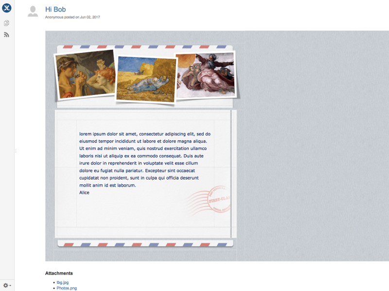
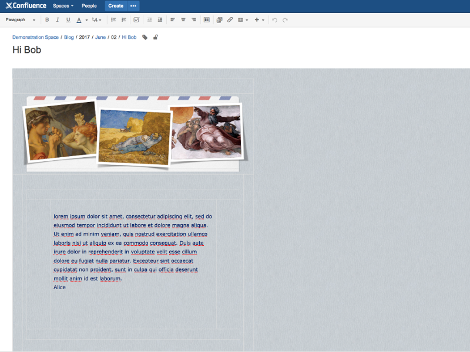
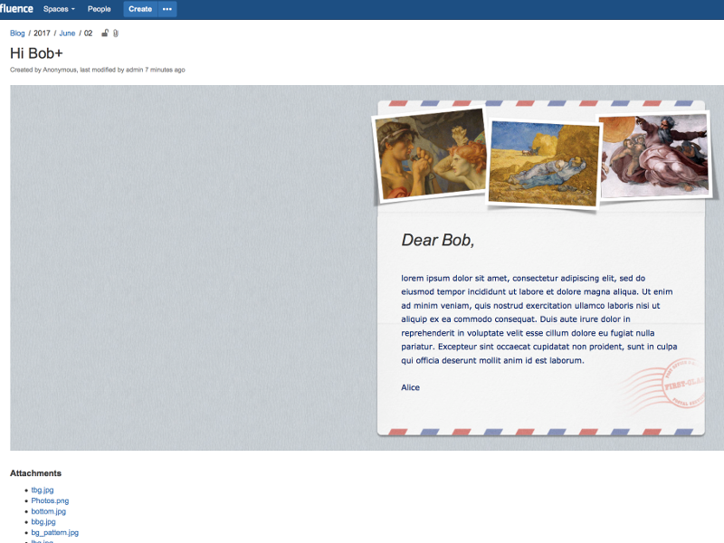
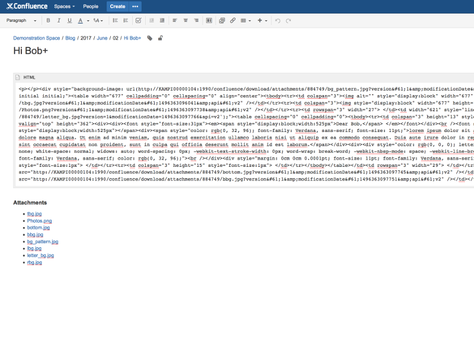
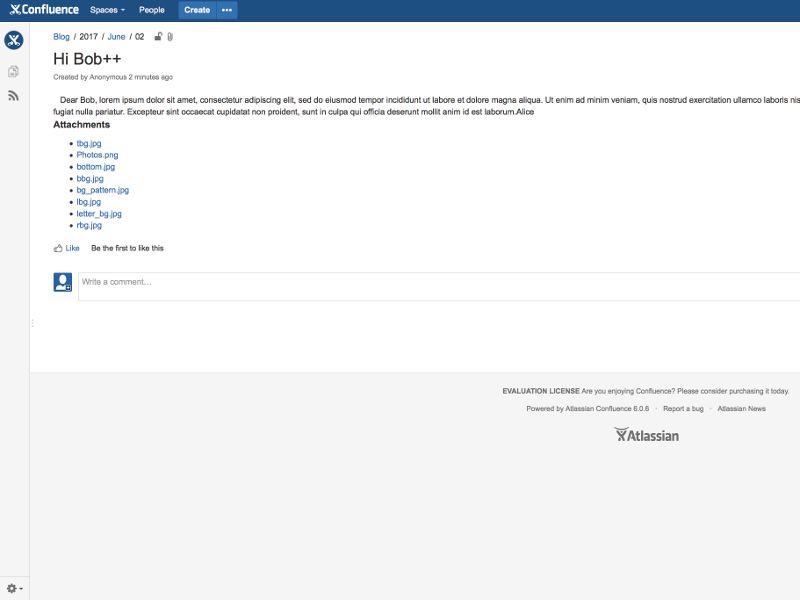
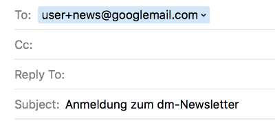
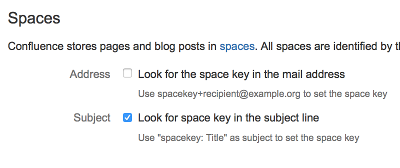
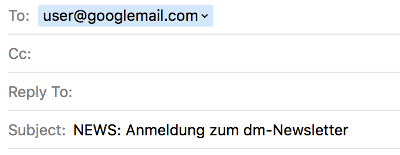

# Advanced Configuration

### Formatting

You can set the preferred content type (plain text or HTML)
and the allowed HTML elements in the formatting section on the configuration page.
You will get very different results depending on the settings chosen.
The following examples should help you to choose the right settings for your use case:

#### Example 1: Preferred format HTML, all elements allowed and HTML macro disabled

These are the default settings. This works great for most HTML mails,
but complex newsletters are usually not rendered flawlessly.
The generated blog posts can be easily edited with the Confluence WYSIWYG-editor.

| Display                               |
| ------------------------------------- |
|   |

| Editor                             |
| ---------------------------------- |
|  |

#### Example 2: Preferred format HTML, all elements allowed and HTML macro enabled

Using the HTML macro even complex newsletters are usually displayed flawlessly,
but you can't edit the message with the Confluence WYSIWYG-editor.
To use this option you need to enable the HTML macro.

**Warning:** Activating the HTML macro in Confluence is a security issue
if non trusted users have permissions to create pages/blog posts

| Display                              |
| ------------------------------------ |
|  |

| Editor                             |
| ---------------------------------- |
|  |
   
#### Example 3: Preferred format text, all elements disallowed and HTML macro disabled

When setting plain text as preferred format the plugin will use the text version of a mail if available.
In HTML only mails all HTML will be stripped if all elements are disallowed.

| Display                              | 
| ------------------------------------ | 
|  | 

| Editor                             |
| ---------------------------------- |
|  |
  
### Spaces

Confluence stores pages and blog posts in [spaces](https://confluence.atlassian.com/doc/spaces-139459.html).
All spaces are identified by their [space key](https://confluence.atlassian.com/doc/space-keys-829076188.html).
By default the plugin posts all mails into the default space. You can enable additional strategies to determine
the space into which to post.

#### Address

If your mail provider supports addresses in [VERP](http://www.postfix.org/VERP_README.html)-style,
you can include the space key in the mail address.
However only a few providers like Googlemail do support VERP, Microsoft Exchange for example does not.

#### Subject

You can include the space key in the subject line.

