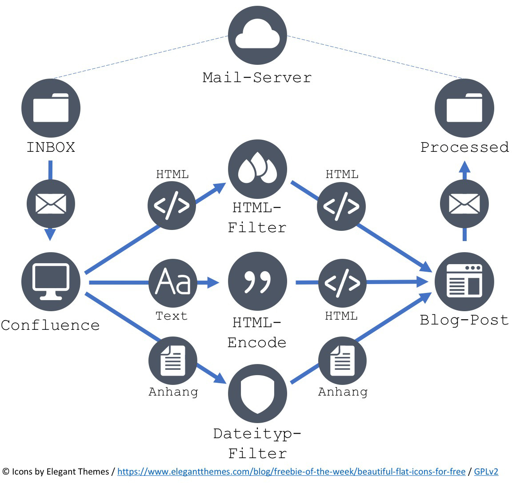
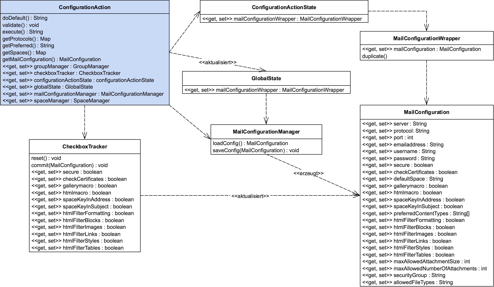

## Technical Documentation

Further information, **in German**, on the code structure of this project is available [here](konzeption_und_entwicklung_des_confluence_add_ons_mail2blog.pdf).

## Compiling

Download and install the [atlassian SDK](https://developer.atlassian.com/docs/getting-started/downloads).
Change the confluence version in the `pom.xml` to your version. Run the `atlas-package` command in the plugin directory.
After successfully compiling the plugin, it will be available in `target/` as `mail2blog-$version.jar`.

## Integration tests

The source code comes with one integration test, that tests the whole process of converting mails to blog posts.
The official atlassian way to run integration tests just proved to be too buggy, so instead a simple rest call can
be used to run an integration test on a test instance. After launching a test instance with `atlas-debug` you
can access the integration test by url:
[/confluence/plugins/servlet/restbrowser#/resource/mail2blog-tests-1-0-runtest-testprocess](http://localhost:1990/confluence/plugins/servlet/restbrowser#/resource/mail2blog-tests-1-0-runtest-testprocess).

## The Main Process

Every 5 minutes the plugin polls the mail server for new mails.
The HTML included in the mail gets filtered and a new blog post with the contained content gets created.
When using IMAP the plugin will move the message into a folder called Processed
after successfully handling the message, in case of an error the message is moved into a folder called Invalid.
When using POP3 the message gets deleted, because POP3 doesn't support folders.

## The Configuration Process

When using the configuration page the user communicates with the controller
`ConfigurationAction`. Initially the active used configuration is cloned,
then all operations are performed on the cloned configuration. After submitting the form successfully,
the new configuration is saved to storage and the global configuration gets set to the new one. This way we ensure
that an incorrect state during form validation isn't used to process messages. The `CheckboxTracker` class is a
workaround for the [issue](https://answers.atlassian.com/questions/120352/check-box-in-velocity) that checkboxes
only submit a value when getting checked and not when getting unchecked.

